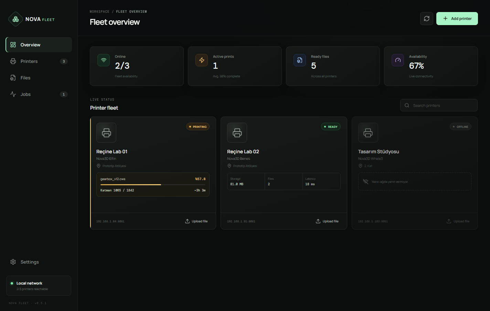
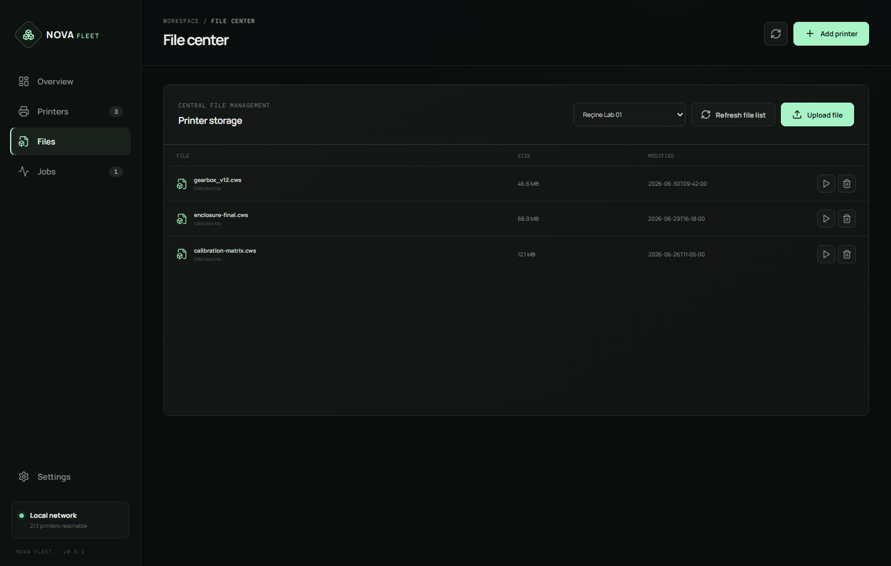
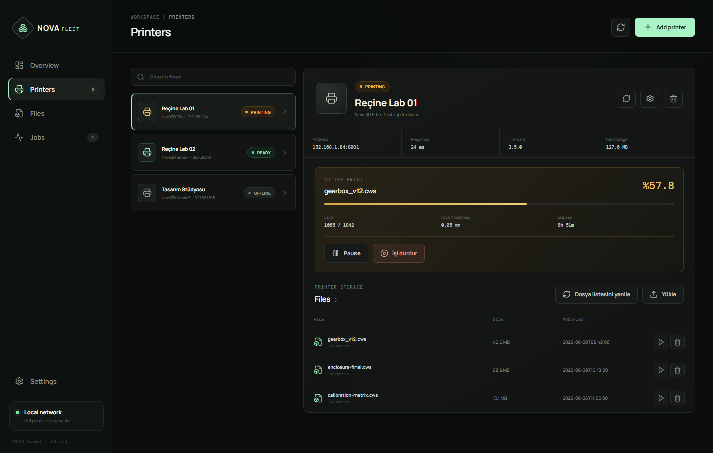
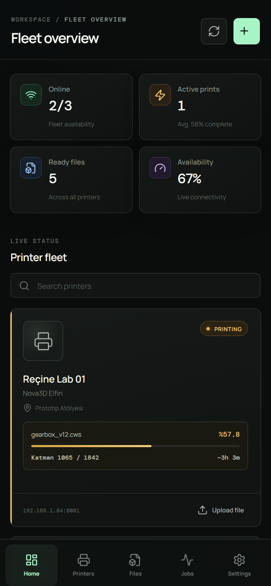

# Nova Fleet

Nova Fleet is a local-first printer fleet manager for Nova3D resin printers and SDCP 3.0 compatible resin printers. It provides a polished Windows desktop app and an Android companion app for monitoring printers, browsing printer storage, and managing local print jobs on the same LAN.

[Turkish documentation](README.tr.md)


## Screenshots

### Windows desktop







### Android / mobile layout



## What Nova Fleet does

Nova Fleet is designed for small resin-printing workspaces that run more than one printer and need a practical local dashboard instead of checking every printer manually.

It can:

- show all configured printers in one fleet overview;
- track online, printing, paused, error, and offline states;
- show active print progress, current layer, total layers, elapsed time, and estimated remaining time when the printer exposes that data;
- list files stored on supported printers;
- upload, delete, and start `.cws` files on supported Nova3D HTTP printers;
- list `.ctb` files on SDCP 3.0 compatible printers;
- store printer profiles locally on the device;
- work without a cloud account or remote server.

## Supported printer modes

Nova Fleet currently supports two local printer protocols.

| Mode | Typical port | File type | Current support |
| --- | ---: | --- | --- |
| Nova3D / Photonic3D HTTP | `8081` | `.cws` | status, files, upload, delete, print, pause/resume, stop |
| SDCP 3.0 | UDP `3000`, TCP `3030` | `.ctb` | discovery, status monitoring, file listing |

SDCP upload and remote print commands are intentionally disabled for now. SDCP printer models can differ in command behavior, so Nova Fleet only enables the SDCP operations that have been implemented defensively: discovery, status, and file listing.

## Download

Get the latest release from the GitHub Releases page:

- Windows installer: `Nova-Fleet-Setup-x.x.x.exe`
- Android APK: `Nova-Fleet-Android-x.x.x.apk`

Latest published release:

- [Nova Fleet v0.5.2](https://github.com/Teknoist/Nova-Fleet/releases/tag/v0.5.2)

## Windows installation

Regular users do not need Node.js, npm, Java, Android Studio, or any development tools.

1. Open [Releases](https://github.com/Teknoist/Nova-Fleet/releases).
2. Download the latest `Nova-Fleet-Setup-x.x.x.exe`.
3. Run the installer.
4. Choose the installation folder.
5. Launch **Nova Fleet** from the desktop shortcut or Start Menu.

The Windows installer is not code-signed yet. Windows SmartScreen may show a warning. If you downloaded the file from this repository's official Releases page, choose **More info -> Run anyway**.

## Android installation

1. Open [Releases](https://github.com/Teknoist/Nova-Fleet/releases).
2. Download the latest `Nova-Fleet-Android-x.x.x.apk`.
3. Transfer the APK to your Android device.
4. Allow installation from the selected source if Android asks.
5. Install and open Nova Fleet.

The Android device and printers must be connected to the same Wi-Fi/LAN. Some routers isolate Wi-Fi clients by default; disable client isolation if the app cannot reach printers that are visible from another device.

## Adding a printer

1. Make sure the printer and the app device are on the same local network.
2. Open **Add printer**.
3. Enter a clear display name, for example `Resin Lab 01`.
4. Enter the printer IP address.
5. Select the correct protocol:
   - choose **Nova / Photonic3D** for older Nova3D HTTP printers;
   - choose **SDCP 3.0** for newer printers that use SDCP.
6. Confirm the port:
   - Nova / Photonic3D usually uses `8081`;
   - SDCP 3.0 usually uses TCP `3030` and UDP discovery on `3000`.
7. Keep the polling interval at `10 seconds` or higher for older firmware.
8. Save the profile and refresh the fleet.

Demo printers are included on first launch so the interface is not empty. You can remove the demo profiles from the Printers page.

## Network requirements

Nova Fleet talks directly to printers on the local network.

For Nova3D / Photonic3D printers:

- HTTP access to `http://PRINTER_IP:8081`
- Browser check: `http://PRINTER_IP:8081/file/list`

For SDCP 3.0 printers:

- UDP discovery on port `3000`
- WebSocket status and file-list requests on TCP `3030`
- WebSocket URL: `ws://PRINTER_IP:3030/websocket`

On Windows, allow Nova Fleet through Windows Firewall for private networks. If ping or browser access works but Nova Fleet does not, firewall rules for UDP `3000` or TCP `3030` are the first thing to check for SDCP printers.

## SDCP 3.0 implementation notes

The SDCP path is not a simple HTTP status endpoint. Nova Fleet uses the SDCP flow expected by SDCP 3.0 printers:

1. Send discovery packet `M99999` over UDP port `3000`.
2. Read the printer response containing `MainboardIP`, `MainboardID`, and device name.
3. Open `ws://PRINTER_IP:3030/websocket`.
4. Request status with SDCP command `0`.
5. Request storage file lists with SDCP command `258`.
6. Normalize returned `.ctb` files into Nova Fleet's file table.

If file listing fails, Nova Fleet keeps the printer online when status data is still available. A file-list problem should not incorrectly mark a working printer as offline.

## Troubleshooting

### Printer is offline

- Confirm the IP address is correct.
- Confirm the computer/phone and printer are on the same LAN or VLAN.
- Restart the printer if its embedded service stopped responding.
- Check whether DHCP changed the printer IP.
- On Windows, allow Nova Fleet through the firewall.
- For SDCP, make sure UDP `3000` and TCP `3030` are reachable.

### Nova3D printer connects but file upload fails

- Use `.cws` files.
- Confirm the printer has enough storage.
- Avoid sending many requests while the printer is busy.
- Very large uploads can take several minutes.

### SDCP printer connects but files are empty

- Confirm the printer stores printable files as `.ctb`.
- Confirm the files are on local or USB storage exposed by SDCP.
- Refresh after the printer finishes scanning or writing storage.
- If status works but files do not, the printer may reject command `258` for that storage path.

## Data and privacy

Nova Fleet stores printer profiles locally on the current device. It does not require a cloud account and does not send printer data to a hosted backend.

On Windows, printer profiles are stored in the Electron application data folder as `printers.json`.

## Developer setup

Requirements:

- Node.js 24
- npm

```powershell
git clone https://github.com/Teknoist/Nova-Fleet.git
cd Nova-Fleet
npm install
npm run dev
```

Validation:

```powershell
npm test
npm run lint
npm run build
```

Build the Windows installer:

```powershell
npm run package:win
```

Sync the Android project:

```powershell
npm run android:sync
```

Build an Android debug APK on a machine with the Android SDK:

```powershell
cd android
.\gradlew.bat assembleDebug
```

## Release process

GitHub Actions builds Windows and Android artifacts. A normal release should include:

- `Nova-Fleet-Setup-x.x.x.exe`
- `Nova-Fleet-Android-x.x.x.apk`

Before publishing a release, run:

```powershell
npm test
npm run lint
npm run build
```

## Security

Most local resin-printer APIs do not provide authentication. Keep printers on a trusted LAN/VLAN and do not expose ports `8081`, `3000`, or `3030` to the public internet.

## License

Nova Fleet is released under the MIT License. See [LICENSE](LICENSE).
